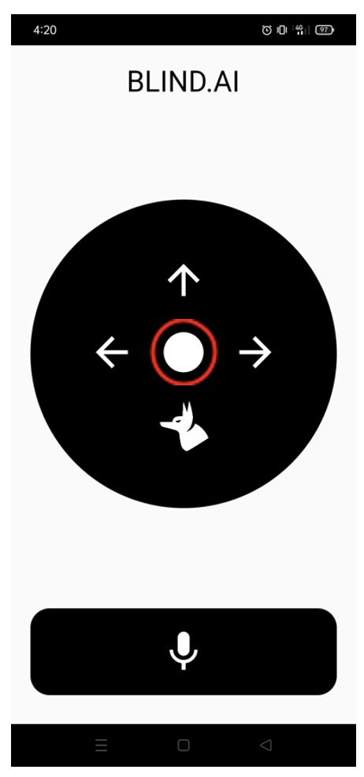
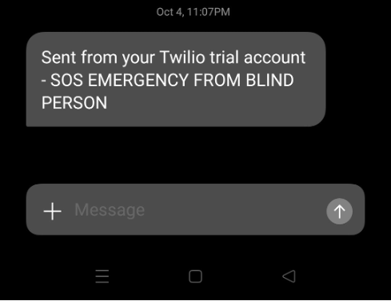
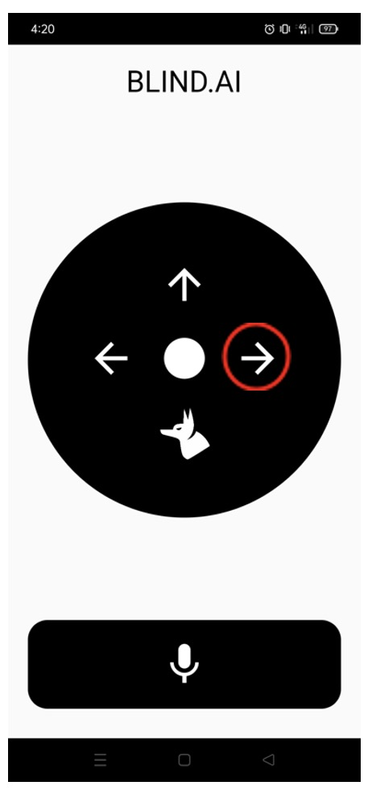
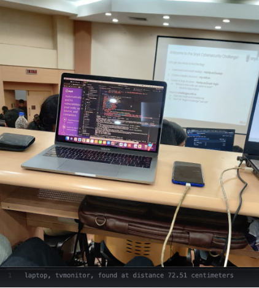
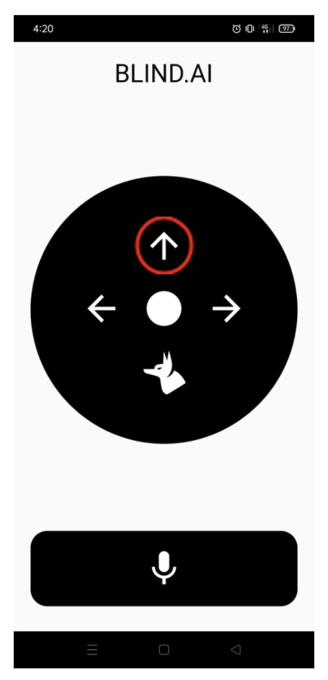
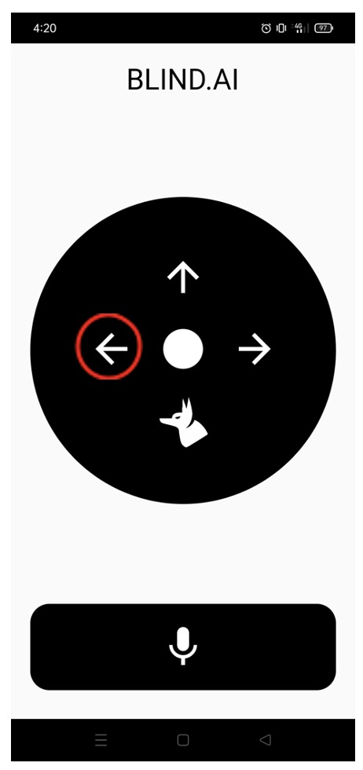
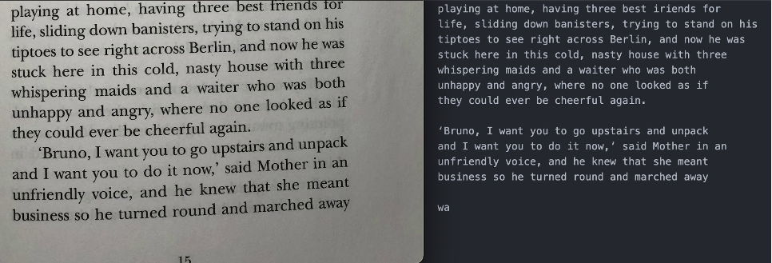
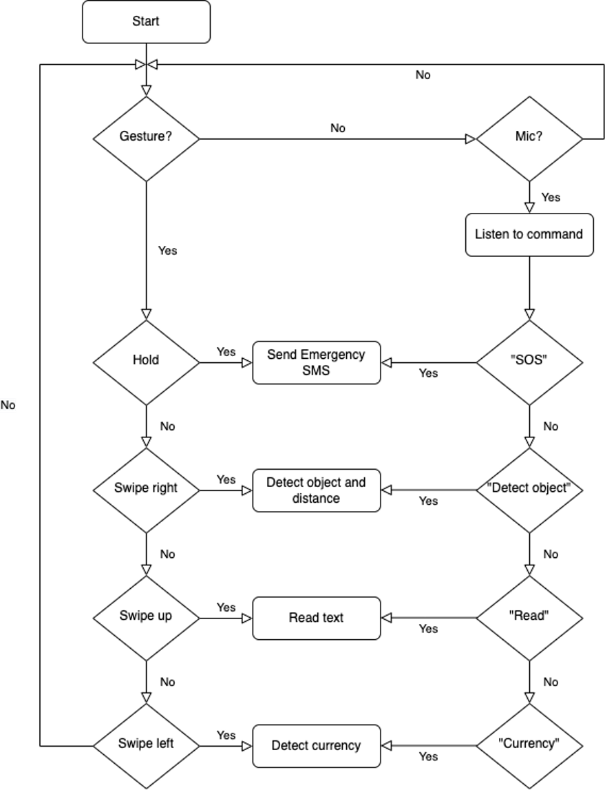

<h1 align="center">
  <br>
  
  <br>
  Blind Eye
  <br>
</h1>

<h4 align="center">An app to make the lives of visually impaired people a little more better.</h4>

<!-- <p align="center">
  <a href="https://badge.fury.io/js/electron-markdownify">
    
  </a>
  <a href="https://gitter.im/amitmerchant1990/electron-markdownify"></a>
  <a href="https://saythanks.io/to/bullredeyes@gmail.com">
      
  </a>
  <a href="https://www.paypal.me/AmitMerchant">
    
  </a>
</p> -->

<p align="center">
  <a href="#introduction">Introduction</a> •
  <a href="#installation">Installation</a> •
  <a href="#application-structure">Application Structure</a> •
  <a href="#key-features">Key Features</a> •
  <a href="#how-to-use">How To Use</a> •
  <a href="#credits">Credits</a> •
  <a href="#support">Support</a> •
  <a href="#contributors">Contributors</a> •
  <a href="#license">License</a>
</p>

<p align="center">

</p>

## Introduction

The development of tools and technology hasn't resulted in the development of applications that could aid those with visual impairments. With the development of Data Modelling techniques, which can be used to give even basic computers a bit of "intelligence," and the ease of accessibility, this "intelligence" can be extended to our smartphones to aid those who are blind in navigating their surroundings and going about their daily lives. By utilising the power of Deep Learning, which can be made accessible even on low-end devices with a clear User-Interface that would precisely allow them to better grasp the world around, our application seeks to close the gap between them and the visible world.

This app enables the community of blind and visually impaired people to correctly identify objects they come across in everyday life without the need for sighted assistance.

## Problem statement:
Vision impairment poses an enormous global financial burden with the annual global costs of productivity losses associated with vision impairment estimated to be US$ 411 billion.
The main challenges faced by blind people include:
- Navigating around places
- Finding reading material.
## Our solution:
- A voice and gesture-based app to make the lives of visually impaired people a little more ordinary.
- This app essentially helps in gaining independence without having to rely on external devices that may not be accessible to most people.

## Installation

Install with pip:

```
$ pip install -r requirements.txt
```

## Application Structure

```
.
blind_ai/
├─ Frontend/
├─ calibration/
│  ├─ Ref_image.png
├─ currency-detection/
│  ├─ currencies/
├─ yolo_v3/
│  ├─ coco.names
│  ├─ yolov3-tiny.cfg
│  ├─ yolov3-tiny.weights
├─ app.py
├─ curr_det.py
├─ requirements.txt
├─ utils.py
├─ .gitignore
├─ Procfile
```

## Key Features

⭐️ SOS - Quickly send alerts to your emergency contacts.
- Quickly send alerts to your emergency contacts by touch and hold gesture on the center of the app or by using the “SOS” command. The app uses the Twilio API to send an SMS to emergency contacts to indicate that immediate help is required.

<p align="center">

<br/>

</p>

⭐️ Object detection - Detects the object in front of you and the distance you are from it.
- Swipe right or use the command “detect object” to detect the object in front of you and find the distance you are from the object. The app uses the yolov3-tiny model for object detection which has a tested mean average precision of 33.1 with 220 fps. We use simple camera calibration to calculate the distance between the user and the object detected.
With the first version of the app, we can detect up to 80 different everyday objects.

<p align="center">

<br/>

</p>

⭐️ Currency detection - Detects currecny denominations.
- Swipe left or use the command “currency” to detect currency denominations.

<p align="center">

<br/>

</p>

⭐️ Read text - Reads the text for you.
- Swipe up or use the command “read text” to read the detected text. This has been implemented using an optical character recognition (OCR) tool that will recognize and read the text embedded in images.

<p align="center">

<br/>

</p>

## APPLICATION FLOWCHART
<p align="center">

</p>

## How To Use

To clone and run this application, you'll need [Git](https://git-scm.com) and [Flutter](https://flutter.dev/).

From your command line:

```bash
# Clone this repository
$ git clone https://github.com/N-liraj-khanna/Blind-AI

# Go into the repository
$ cd Blind-AI-Backend

# Install dependencies
$ pip install -r requirements.txt

# Run the app
$ flask run
```

## Credits

This software uses the following open source packages:

- [Flutter](https://flutter.dev/)
- [Python](https://www.python.org/)
- [Python Anywhere](https://www.pythonanywhere.com/)
- [Twilio](https://www.twilio.com/)
- [Flask](https://flask.palletsprojects.com/en/2.2.x/)


## Contributors

[@N-liraj-khanna](https://github.com/N-liraj-khanna) &nbsp;&middot;&nbsp;
[@Nilavan](https://github.com/Nilavan) &nbsp;&middot;&nbsp;
[@ajith-m](https://github.com/ajith-m-doodlebug) &nbsp;&middot;&nbsp;
[@calicartels](https://github.com/calicartels/) &nbsp;&middot;&nbsp;

## License

MIT

---


> GitHub [@N-liraj-khanna](https://github.com/N-liraj-khanna) &nbsp;&middot;&nbsp;